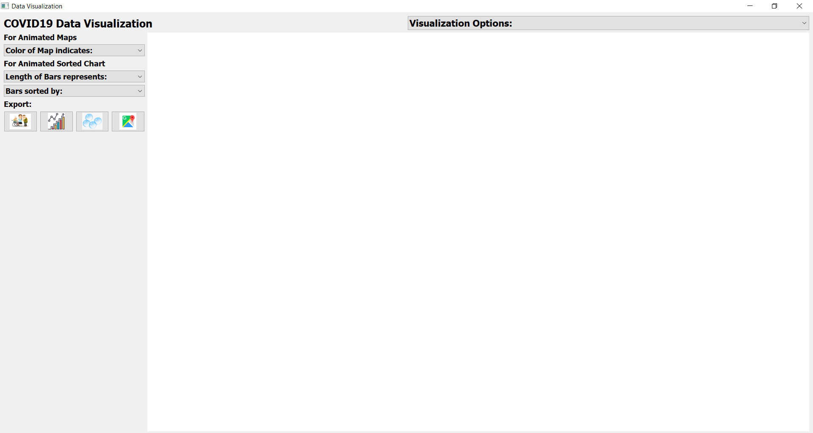
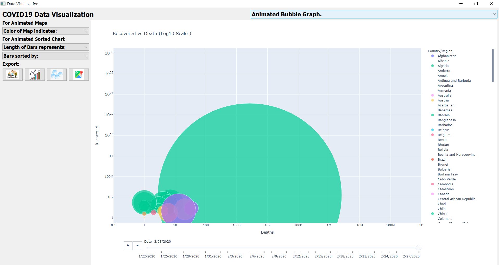
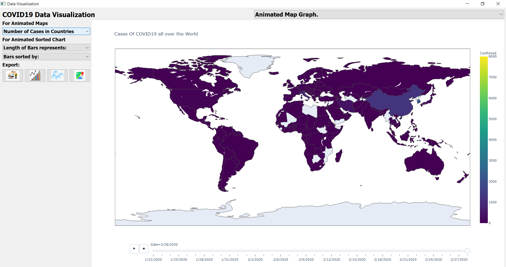

# Data Visualization Project

## About:

In this project, I visualize data of COVID19 datasets using animated Bubbles , animated Maps and Animated sorted bars using plotly library in Python.

## Results:

1- Main window:

2- Animated Bubble Graph:

3- Animated Map Graph:

 
